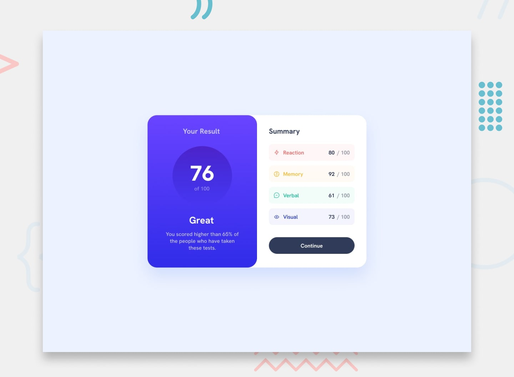

# Frontend Mentor - Results summary component

## Welcome! 👋

Thanks for checking out this front-end coding challenge.

[Frontend Mentor](https://www.frontendmentor.io) challenges help you improve your coding skills by building realistic projects.

**To do this challenge, you need a basic understanding of HTML and CSS.**

## The challenge

Your challenge is to build out this results summary component and get it looking as close to the design as possible.

You can use any tools you like to help you complete the challenge. So if you've got something you'd like to practice, feel free to give it a go.

We provide the data for the results in a local `data.json` file. So you can use that to add the results and total score dynamically if you choose.

Your users should be able to:

- View the optimal layout for the interface depending on their device's screen size
- See hover and focus states for all interactive elements on the page
- **Bonus**: Use the local JSON data to dynamically populate the content

Want some support on the challenge? [Join our community](https://www.frontendmentor.io/community) and ask questions in the **#help** channel.

## Where to find everything

Your task is to build out the project to the designs inside the `/design` folder. You will find both a mobile and a desktop version of the design. 

The designs are in JPG static format. Using JPGs will mean that you'll need to use your best judgment for styles such as `font-size`, `padding` and `margin`. 

If you would like the Figma design file to gain experience using professional tools and build more accurate projects faster, you can [subscribe as a PRO member](https://www.frontendmentor.io/pro).

All the required assets for this project are in the `/assets` folder. The images are already exported for the correct screen size and optimized.

We also include variable and static font files for the required fonts for this project. You can choose to either link to Google Fonts or use the local font files to host the fonts yourself. Note that we've removed the static font files for the font weights that aren't needed for this project.

There is also a `style-guide.md` file containing the information you'll need, such as color palette and fonts.

## Building your project

Feel free to use any workflow that you feel comfortable with. Below is a suggested process, but do not feel like you need to follow these steps:

1. Initialize your project as a public repository on [GitHub](https://github.com/). Creating a repo will make it easier to share your code with the community if you need help. If you're not sure how to do this, [have a read-through of this Try Git resource](https://try.github.io/).
2. Configure your repository to publish your code to a web address. This will also be useful if you need some help during a challenge as you can share the URL for your project with your repo URL. There are a number of ways to do this, and we provide some recommendations below.
3. Look through the designs to start planning out how you'll tackle the project. This step is crucial to help you think ahead for CSS classes to create reusable styles.
4. Before adding any styles, structure your content with HTML. Writing your HTML first can help focus your attention on creating well-structured content.
5. Write out the base styles for your project, including general content styles, such as `font-family` and `font-size`.
6. Start adding styles to the top of the page and work down. Only move on to the next section once you're happy you've completed the area you're working on.

## Deploying your project

As mentioned above, there are many ways to host your project for free. Our recommended hosts are:

- [GitHub Pages](https://pages.github.com/)
- [Vercel](https://vercel.com/)
- [Netlify](https://www.netlify.com/)

You can host your site using one of these solutions or any of our other trusted providers. [Read more about our recommended and trusted hosts](https://medium.com/frontend-mentor/frontend-mentor-trusted-hosting-providers-bf000dfebe).

## Create a custom `README.md`

We strongly recommend overwriting this `README.md` with a custom one. We've provided a template inside the [`README-template.md`](./README-template.md) file in this starter code.

The template provides a guide for what to add. A custom `README` will help you explain your project and reflect on your learnings. Please feel free to edit our template as much as you like.

Once you've added your information to the template, delete this file and rename the `README-template.md` file to `README.md`. That will make it show up as your repository's README file.

## Submitting your solution

Submit your solution on the platform for the rest of the community to see. Follow our ["Complete guide to submitting solutions"](https://medium.com/frontend-mentor/a-complete-guide-to-submitting-solutions-on-frontend-mentor-ac6384162248) for tips on how to do this.

Remember, if you're looking for feedback on your solution, be sure to ask questions when submitting it. The more specific and detailed you are with your questions, the higher the chance you'll get valuable feedback from the community.

## Sharing your solution

There are multiple places you can share your solution:

1. Share your solution page in the **#finished-projects** channel of the [community](https://www.frontendmentor.io/community). 
2. Tweet [@frontendmentor](https://twitter.com/frontendmentor) and mention **@frontendmentor**, including the repo and live URLs in the tweet. We'd love to take a look at what you've built and help share it around.
3. Share your solution on other social channels like LinkedIn.
4. Blog about your experience building your project. Writing about your workflow, technical choices, and talking through your code is a brilliant way to reinforce what you've learned. Great platforms to write on are [dev.to](https://dev.to/), [Hashnode](https://hashnode.com/), and [CodeNewbie](https://community.codenewbie.org/).

We provide templates to help you share your solution once you've submitted it on the platform. Please do edit them and include specific questions when you're looking for feedback. 

The more specific you are with your questions the more likely it is that another member of the community will give you feedback.

## Got feedback for us?

We love receiving feedback! We're always looking to improve our challenges and our platform. So if you have anything you'd like to mention, please email hi@frontendmentor.io.

This challenge is completely free. Please share it with anyone who will find it useful for practice.

**Have fun building!** 🚀

---

# Türkçe Çeviri

## Hoş geldiniz! 👋

Bu front-end kodlama meydan okumasını incelediğiniz için teşekkürler.

[Frontend Mentor](https://www.frontendmentor.io) meydan okumaları, gerçekçi projeler oluşturarak kodlama becerilerinizi geliştirmenize yardımcı olur.

**Bu meydan okumayı yapmak için temel HTML ve CSS bilgisine ihtiyacınız var.**

## Meydan Okuma

Bu sonuç özet bileşenini oluşturmanız ve tasarıma mümkün olduğunca yakın hale getirmeniz gerekiyor.

Bu meydan okumayı tamamlamak için istediğiniz araçları kullanabilirsiniz. Denemek istediğiniz bir şey varsa, rahatça kullanabilirsiniz.

Sonuçlar için verileri yerel `data.json` dosyasında sağlıyoruz. İsterseniz bu verileri kullanarak sonuçları ve toplam puanı dinamik olarak ekleyebilirsiniz.

Kullanıcılarınız şunları yapabilmeli:

- Cihazlarının ekran boyutuna göre arayüzün en uygun düzenini görebilmeli
- Sayfadaki tüm etkileşimli öğeler için hover ve odak durumlarını görebilmeli
- **Bonus**: Yerel JSON verisini kullanarak içeriği dinamik olarak doldurabilmeli

Meydan okuma hakkında destek mi istiyorsunuz? [Topluluğumuza katılın](https://www.frontendmentor.io/community) ve **#help** kanalında sorularınızı sorun.

## Her Şeyi Nerede Bulabilirim?

Projenizi `/design` klasöründeki tasarımlara göre oluşturmanız gerekiyor. Hem mobil hem de masaüstü tasarımını bulacaksınız.

Tasarım dosyaları JPG formatında statik görsellerdir. JPG kullandığınızda, `font-size`, `padding` ve `margin` gibi stiller için en iyi tahmininizi kullanmanız gerekecek.

Profesyonel araçlar kullanarak daha doğru projeler oluşturmak ve deneyim kazanmak isterseniz, [PRO üye olarak](https://www.frontendmentor.io/pro) Figma tasarım dosyasına erişebilirsiniz.

Bu proje için gereken tüm varlıklar `/assets` klasöründe mevcut. Görseller doğru ekran boyutuna göre dışa aktarılmış ve optimize edilmiştir.

Gerekli fontlar için değişken ve statik font dosyalarını da ekledik. Google Fonts'a bağlanabilir veya fontları yerel olarak barındırabilirsiniz. Gerekli olmayan font ağırlıkları için statik font dosyalarını kaldırdık.

Renk paleti ve fontlar gibi ihtiyacınız olan bilgileri içeren bir `style-guide.md` dosyası da mevcut.

## Projenizi Oluşturmak

Kendinizi rahat hissettiğiniz herhangi bir iş akışını kullanabilirsiniz. Aşağıda önerilen bir süreç var, ancak bu adımları takip etmek zorunda değilsiniz:

1. Projenizi [GitHub](https://github.com/) üzerinde herkese açık bir depo olarak başlatın. Bir depo oluşturmak, kodunuzu toplulukla paylaşmanızı kolaylaştırır. Nasıl yapılacağını bilmiyorsanız, [bu Try Git kaynağını](https://try.github.io/) inceleyin.
2. Depoyu bir web adresine yayınlayacak şekilde yapılandırın. Bu, meydan okuma sırasında yardım almak isterseniz projenizin URL'sini paylaşmanızı sağlar. Bunu yapmanın birkaç yolu var, aşağıda bazı öneriler sunduk.
3. Tasarımları inceleyerek projeyi nasıl ele alacağınızı planlamaya başlayın. Bu adım, yeniden kullanılabilir stiller için CSS sınıflarını önceden düşünmenize yardımcı olur.
4. Herhangi bir stil eklemeden önce içeriğinizi HTML ile yapılandırın. Önce HTML yazmak, iyi yapılandırılmış içerik oluşturmanıza odaklanmanıza yardımcı olur.
5. Projeniz için temel stilleri yazın, genel içerik stilleri dahil, örneğin `font-family` ve `font-size`.
6. Sayfanın üstünden başlayarak stilleri eklemeye başlayın ve aşağıya doğru ilerleyin. Üzerinde çalıştığınız alanı tamamladığınızdan emin olmadan bir sonraki bölüme geçmeyin.

## Projenizi Yayınlamak

Yukarıda belirtildiği gibi, projenizi ücretsiz olarak barındırmanın birçok yolu var. Önerdiğimiz barındırıcılar:

- [GitHub Pages](https://pages.github.com/)
- [Vercel](https://vercel.com/)
- [Netlify](https://www.netlify.com/)

Sitenizi bu çözümlerden biriyle veya diğer güvenilir sağlayıcılarımızdan biriyle barındırabilirsiniz. [Önerilen ve güvenilir barındırıcılarımız hakkında daha fazla bilgi edinin](https://medium.com/frontend-mentor/frontend-mentor-trusted-hosting-providers-bf000dfebe).

## Özel Bir `README.md` Oluşturun

Bu `README.md` dosyasını özel bir dosya ile değiştirmenizi şiddetle tavsiye ediyoruz. Başlangıç kodunda [`README-template.md`](./README-template.md) dosyasında bir şablon sağladık.

Şablon, neler eklemeniz gerektiği konusunda rehberlik sağlar. Özel bir `README`, projenizi açıklamanıza ve öğrendiklerinizi yansıtmanıza yardımcı olur. Şablonumuzu dilediğiniz gibi düzenleyebilirsiniz.

Bilgilerinizi şablona ekledikten sonra bu dosyayı silin ve `README-template.md` dosyasının adını `README.md` olarak değiştirin. Böylece depo README dosyanız olarak görünecektir.

## Çözümünüzü Göndermek

Çözümünüzü platformda gönderin ve topluluğun geri kalanının görmesini sağlayın. Bunu nasıl yapacağınızla ilgili ipuçları için ["Çözüm gönderme rehberi"](https://medium.com/frontend-mentor/a-complete-guide-to-submitting-solutions-on-frontend-mentor-ac6384162248) yazımızı inceleyin.

Çözümünüz hakkında geri bildirim almak istiyorsanız, gönderirken sorularınızı sormayı unutmayın. Sorularınız ne kadar spesifik ve detaylı olursa, topluluktan değerli geri bildirim alma şansınız o kadar yüksek olur.

## Çözümünüzü Paylaşmak

Çözümünüzü paylaşabileceğiniz birkaç yer var:

1. Çözüm sayfanızı [topluluğun](https://www.frontendmentor.io/community) **#finished-projects** kanalında paylaşın.
2. [@frontendmentor](https://twitter.com/frontendmentor) hesabına tweet atın ve **@frontendmentor**'ı etiketleyin, tweet'e depo ve canlı URL'leri ekleyin. Yaptıklarınızı görmek ve paylaşmak isteriz.
3. Çözümünüzü LinkedIn gibi diğer sosyal kanallarda paylaşın.
4. Projenizi oluşturma deneyiminiz hakkında blog yazın. İş akışınızı, teknik tercihlerinizi ve kodunuzu anlatmak öğrendiklerinizi pekiştirmenin harika bir yoludur. Yazmak için harika platformlar: [dev.to](https://dev.to/), [Hashnode](https://hashnode.com/), ve [CodeNewbie](https://community.codenewbie.org/).

Çözümünüzü platformda gönderdikten sonra paylaşmanıza yardımcı olacak şablonlar sağlıyoruz. Lütfen düzenleyin ve geri bildirim almak istediğinizde spesifik sorular ekleyin.

Sorularınız ne kadar spesifik olursa, topluluktan geri bildirim alma olasılığınız o kadar yüksek olur.

## Bize Geri Bildiriminiz Var mı?

Geri bildirim almayı çok seviyoruz! Meydan okumalarımızı ve platformumuzu geliştirmek için her zaman çalışıyoruz. Belirtmek istediğiniz bir şey varsa, lütfen hi@frontendmentor.io adresine e-posta gönderin.

Bu meydan okuma tamamen ücretsizdir. Uygulama yapmak isteyen herkesle paylaşabilirsiniz.

**İyi eğlenceler!** 🚀
